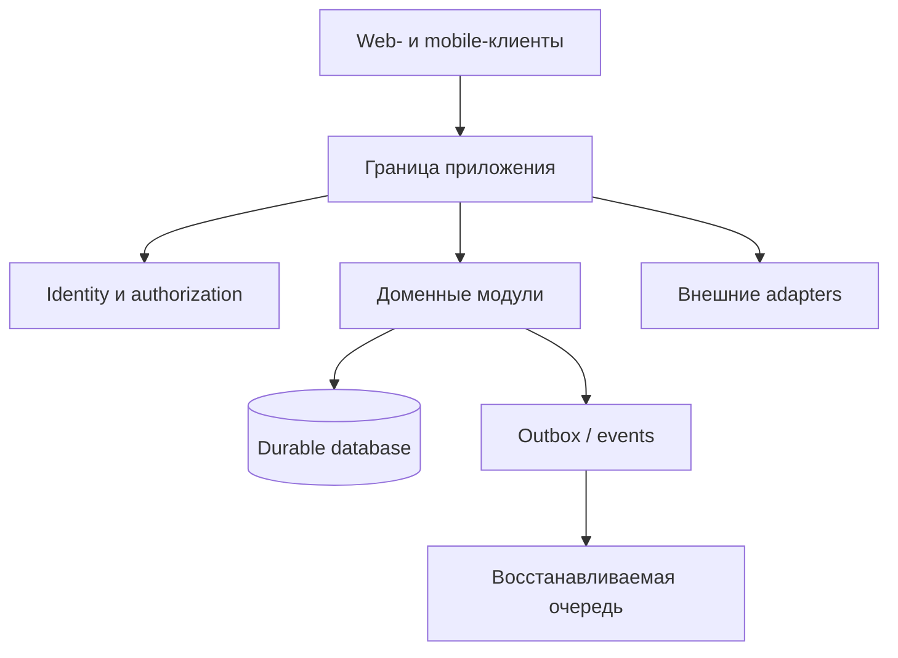

# Архитектурные границы

Основные проекты в портфолио используют modular monolith и adapters там, где преждевременное разделение на microservices ухудшило бы транзакционную целостность и эксплуатацию.

## Правила границ

- Database остаётся источником истины для durable domain state.
- Queues, caches и realtime payloads должны допускать восстановление или повторное чтение.
- Внешний provider не владеет внутренними бизнес-сущностями.
- Authentication устанавливает identity; authorization отдельно проверяется для конкретного resource.
- Domain module выносится в отдельный сервис, только когда измеренные требования по эксплуатации или масштабированию оправдывают сетевую границу.
- Скрытый frontend-элемент не заменяет backend authorization.

## Почему система не дробится заранее

В рассмотренных проектах есть операции между тесно связанными сущностями: платёж и активация продукта, продажа товара и финансовый доход, создание сообщения и receipts/notifications, проводка и изменение balance/audit. Единая database и application boundary упрощают корректность и восстановление таких сценариев.

Foundation сервиса уведомлений — обоснованный эксперимент с отдельной service boundary: у него durable ingestion/outbox contract и явно принятая at-least-once delivery semantics. Он не заявляется работающим в production до acceptance транспорта и migration.
