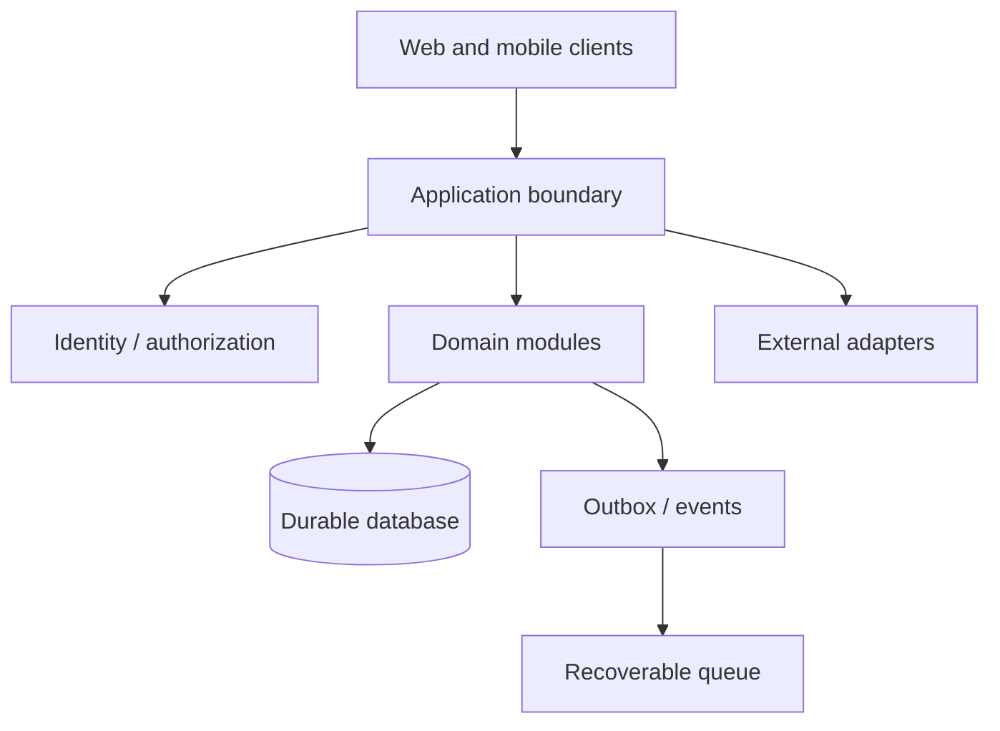

# System Boundaries

The strongest projects in this portfolio use modular monoliths and adapters rather than defaulting to microservices.

## Boundary rules

- The database is authoritative for durable domain state.
- Queues, caches, and realtime payloads can be reconstructed or refetched.
- External providers do not own internal business entities.
- Authentication establishes identity; authorization is evaluated separately for the exact resource.
- A domain module can be extracted only when measured operational or scaling needs justify the network boundary.
- A frontend visibility rule never substitutes for backend authorization.

## Why not split early

The examined systems contain transactions that cross closely related concepts: payment plus product activation, inventory sale plus financial income, message creation plus receipts/notifications, and account entry plus balance/audit. Keeping those operations within one database and application boundary simplifies correctness and recovery.

The notification foundation is a justified separate-service experiment because it defines a durable ingestion/outbox contract and explicitly accepts at-least-once delivery. It is not presented as live until transport and migration acceptance exist.

