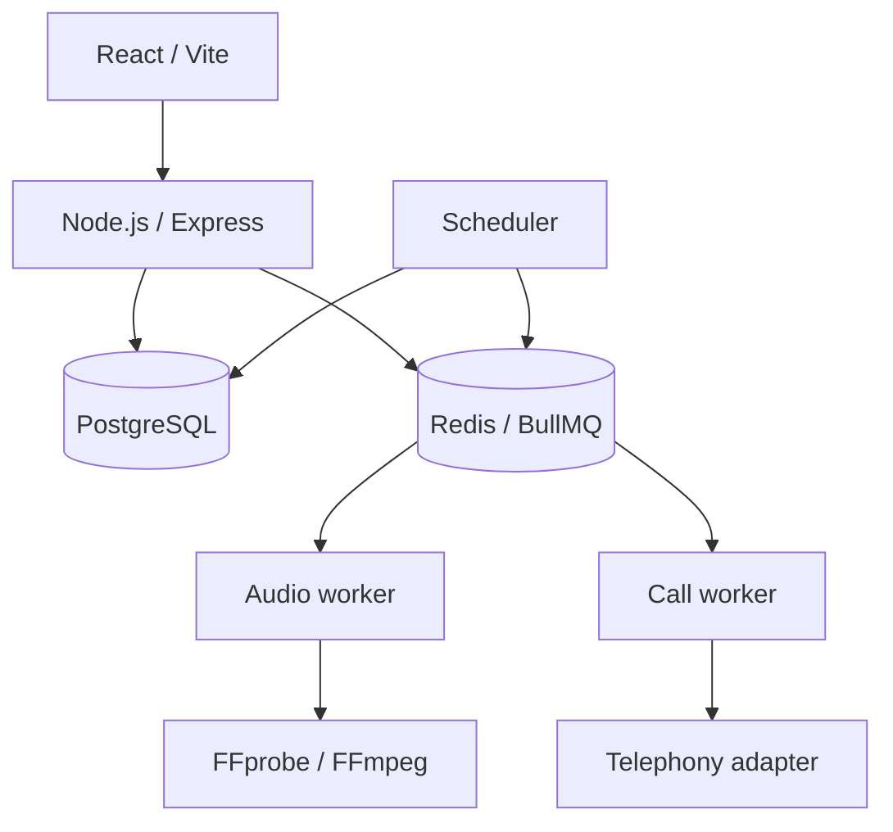

# Коммерческий асинхронный сервис

Источник — приватная система. Product-specific данные и конфигурация внешнего provider не публикуются.

## Задача

Пользовательский сервис должен был принимать заказы и платежи, создавать один из нескольких цифровых продуктов, планировать будущую работу, обрабатывать загруженные аудиофайлы и восстанавливать незавершённые фоновые задачи после перезапуска процесса или host.

## Ограничения

- Payment callbacks могут повторяться и приходить не по порядку.
- Redis не должен быть единственным хранилищем работы, которая обязана завершиться.
- Загруженный аудиофайл — недоверенный input; имени файла и заявленного MIME type недостаточно для приёма.
- Контактные данные и management capabilities требуют защиты at rest.
- Telephony-зависимый продукт должен оставаться безопасно отключённым, пока реальный provider не пройдёт acceptance.
- PostgreSQL и Redis нельзя напрямую публиковать в production network.

## Архитектура и подход

PostgreSQL хранит авторитетное состояние заказов, платежей, звонков, аудио и попыток выполнения. BullMQ доставляет задачи исполнителям. Scheduler и процедуры восстановления заново создают отсутствующие jobs по состоянию базы данных: потеря Redis задерживает обработку, но не уничтожает долговременную запись о работе.

## Что я реализовал

- React/TypeScript frontend и API на Node.js/Express.
- PostgreSQL schemas и migrations с checksums для заказов, нескольких типов продукта, запланированных звонков, аудио, попыток и истории аудита.
- Создание и проверку online payment: сумма, валюта, metadata и идемпотентная финализация оплаченного заказа внутри database transaction.
- Явные state machines для lifecycle звонка и обработки аудио.
- BullMQ workers для планирования, выполнения, FFmpeg processing и очистки по retention policy.
- Восстановление pending/stale задач обработки аудио и захваченных звонков после restart.
- Server-side проверку upload, duration/format, нормализацию и кодирование под требования telephony.
- AES-256-GCM для чувствительных контактных данных и keyed hashes с timing-safe comparison для management tokens.
- Раздельное Compose-поведение для development/production и процедуры backup, restore, deployment и rollback.

## Ключевые инженерные решения

1. **Платёж проверяется, а не принимается на доверии.** Перед финализацией внутри транзакции сверяются состояние у provider, валюта, сумма и metadata заказа.
2. **Повторный callback возвращает уже созданный продукт.** Оплаченный заказ — стабильный terminal fact, поэтому retry webhook не создаёт второй экземпляр.
3. **Идентификатор в очереди детерминирован.** Job ID включает доменный объект и номер попытки, что обеспечивает безопасные retries и подавление дублей.
4. **Восстановление начинается с durable state.** Workers находят pending/stale записи и заново наполняют BullMQ; очередь не используется как database.
5. **Непринятая интеграция выключена по умолчанию.** Mock telephony не может выполнять оплаченные production calls, реальный call module остаётся выключенным до acceptance.

## Надёжность, безопасность и тестирование

- Автоматизированные tests покрывают state machine, cryptography, scheduling, расчёт стоимости, repositories, routes и поведение платежей.
- Workers используют bounded concurrency, retry/backoff, deterministic IDs, heartbeats и graceful shutdown.
- PostgreSQL row locks защищают платежи и переходы lifecycle.
- Сервисы баз данных находятся во внутренней Compose network, порты приложения доступны через reverse proxy.
- Rollback сохраняет backward-compatible schema changes и требует reconciliation orders/payments перед retry.

## Результат

Коммерческий сервис выполняет реальный процесс заказа и оплаты. Асинхронная подсистема звонков реализована — durable scheduling, обработка аудио, recovery и provider abstraction, — но live telephony намеренно не заявляется запущенной до acceptance внешней интеграции.

## Что доказывает кейс

- Проектирование жизненного цикла order и payment.
- PostgreSQL как source of truth при Redis/BullMQ execution.
- Idempotency, state machines, recovery, FFmpeg processing, encryption и rate limiting.
- Production-oriented Docker deployment, backup, restore и rollback.

Связанный пример: [recoverable outbox](../../backend/recoverable-outbox.ts).
