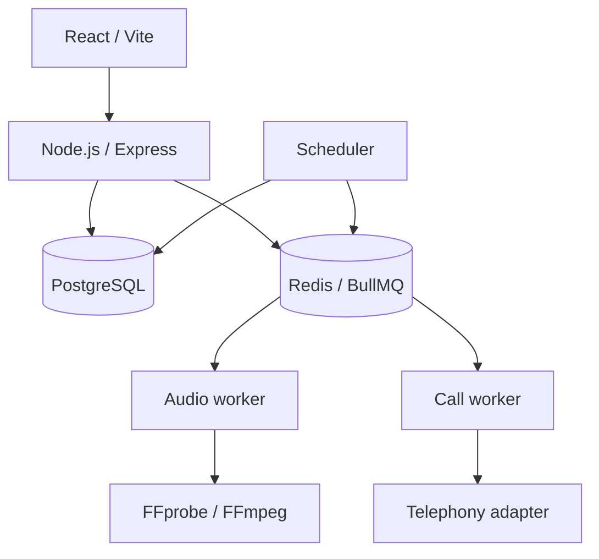

# Commercial Asynchronous Service

Private source system. Product-specific data and provider configuration are omitted.

# Problem

A customer-facing service needed to accept orders and payments, create one of several digital products, schedule future work, process uploaded audio, and recover unfinished background work after process or host restarts.

# Constraints

- Payment callbacks are repeatable and may arrive out of order.
- Redis cannot be the only record of work that must eventually complete.
- User audio is untrusted input and must not be accepted by filename or MIME claim alone.
- Sensitive contact data and management capabilities require protection at rest.
- The telephony-dependent product must remain safely disabled until a real provider passes acceptance.
- PostgreSQL and Redis must not be directly exposed in production.

# Architecture / approach

PostgreSQL owns order, payment, call, audio, and attempt state. BullMQ carries execution work. Scheduler and recovery routines reconstruct missing jobs from database state, so Redis loss causes delay rather than loss of authoritative work.

# My implementation

- Built the React/TypeScript frontend and Node.js/Express API.
- Designed PostgreSQL schemas and checksum-protected migrations for orders, multiple product types, scheduled calls, audio, attempts, and audit history.
- Integrated online payment creation and verification, including amount/currency/metadata checks and idempotent paid-order finalization.
- Implemented explicit call and audio state machines.
- Built BullMQ workers for scheduling, execution, FFmpeg processing, and retention cleanup.
- Added recovery of pending or stale audio tasks and stale claimed calls after restart.
- Implemented server-side upload inspection, duration/format validation, normalization, and telephony-specific encoding.
- Added AES-256-GCM encryption for sensitive contact data and keyed hashes with timing-safe comparison for management tokens.
- Separated development and production Compose behavior and documented backup, restore, deployment, and rollback.

# Interesting engineering decisions

1. **Payments are verified, not trusted.** Finalization checks provider state, currency, amount, and order metadata inside a database transaction.
2. **Repeat callbacks return the existing product.** A paid order is a stable terminal fact, so webhook retries do not create a second product.
3. **Queue identity is deterministic.** Job IDs combine the domain object and attempt number, allowing safe retries and duplicate suppression.
4. **Recovery starts from durable state.** Workers scan for pending/stale records and repopulate BullMQ instead of treating the queue as a database.
5. **Unsafe integration is off by default.** Mock telephony cannot execute paid production calls, and the real call module remains disabled until acceptance.

# Reliability / security / testing

- State-machine, crypto, scheduling, pricing, repository, routes, and payment behavior have automated tests.
- Workers use bounded concurrency, retry/backoff, deterministic IDs, heartbeats, and graceful shutdown.
- PostgreSQL row locks protect payment and lifecycle transitions.
- Production deployment keeps databases on the internal Compose network and binds application ports behind a reverse proxy.
- Rollback retains backward-compatible schema changes and requires payment/order reconciliation before retries.

# Result

The commercial service runs a real order and payment flow. The asynchronous call subsystem is implemented with durable scheduling, audio processing, recovery, and provider abstraction, while its live telephony capability is deliberately not represented as launched until the provider boundary is accepted.

# What this case demonstrates

- Payment and order lifecycle engineering.
- PostgreSQL as source of truth with Redis/BullMQ execution.
- Idempotency, state machines, recovery, FFmpeg processing, encryption, and rate limiting.
- Production-minded Docker deployment, backup, restore, and rollback.

Related sample: [recoverable outbox worker](../../backend/recoverable-outbox.ts).

