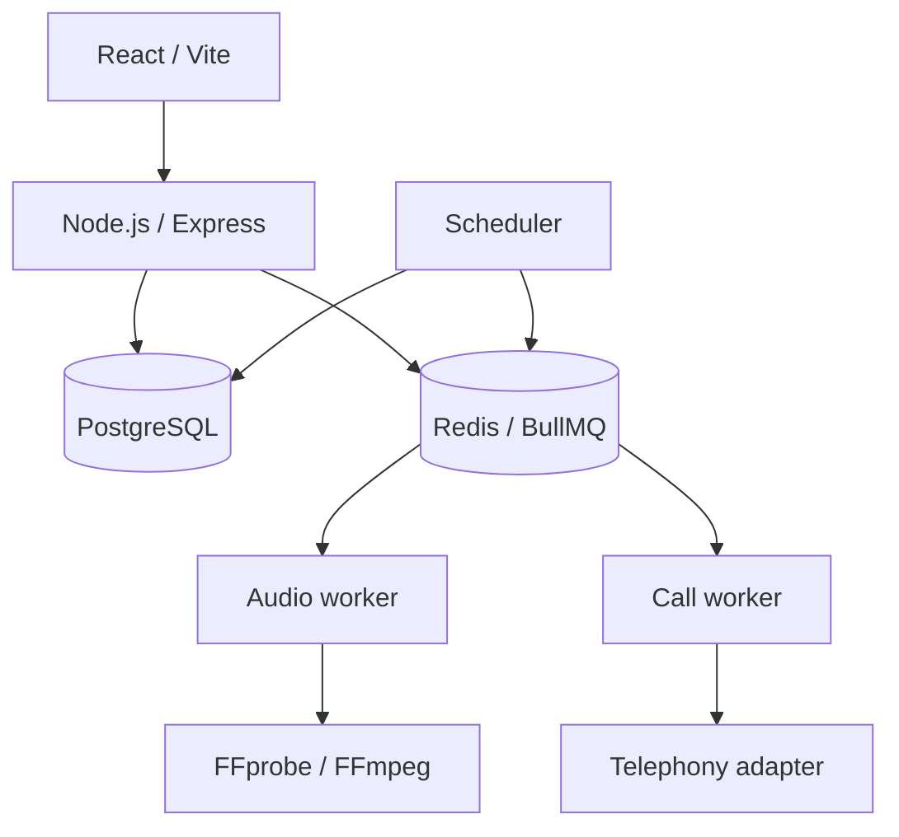

# Коммерческий асинхронный сервис

Источник — приватная система. Product-specific данные и конфигурация внешнего provider не публикуются.

## Задача

Пользовательский сервис должен был принимать заказы и платежи, создавать один из нескольких цифровых продуктов, планировать будущую работу, обрабатывать загруженное audio и восстанавливать незавершённые background jobs после перезапуска процесса или host.

## Ограничения

- Payment callbacks могут повторяться и приходить не по порядку.
- Redis не должен быть единственным хранилищем работы, которая обязана завершиться.
- User audio — недоверенный input; имени файла и MIME claim недостаточно для приёма.
- Контактные данные и management capabilities требуют защиты at rest.
- Telephony-зависимый продукт должен оставаться безопасно отключённым, пока реальный provider не пройдёт acceptance.
- PostgreSQL и Redis нельзя напрямую публиковать в production network.

## Архитектура и подход

PostgreSQL хранит авторитетное состояние orders, payments, calls, audio и attempts. BullMQ переносит execution jobs. Scheduler и recovery routines восстанавливают отсутствующие jobs из database state: потеря Redis задерживает обработку, но не уничтожает durable-факт о работе.

## Что я реализовал

- React/TypeScript frontend и API на Node.js/Express.
- PostgreSQL schemas и защищённые checksums migrations для orders, нескольких product types, scheduled calls, audio, attempts и audit history.
- Создание и проверку online payment: amount, currency, metadata и идемпотентная финализация paid order внутри database transaction.
- Явные state machines для call и audio lifecycle.
- BullMQ workers для scheduling, execution, FFmpeg processing и retention cleanup.
- Восстановление pending/stale audio tasks и stale claimed calls после restart.
- Server-side inspection upload, проверку duration/format, normalization и telephony-specific encoding.
- AES-256-GCM для чувствительных контактных данных и keyed hashes с timing-safe comparison для management tokens.
- Раздельное Compose-поведение для development/production и процедуры backup, restore, deployment и rollback.

## Ключевые инженерные решения

1. **Payment проверяется, а не принимается на доверии.** Перед финализацией внутри транзакции сверяются provider state, currency, amount и order metadata.
2. **Повторный callback возвращает уже созданный продукт.** Paid order — стабильный terminal fact, поэтому retry webhook не создаёт второй экземпляр.
3. **Queue identity детерминирована.** Job ID включает domain object и номер attempt, поддерживая безопасные retries и duplicate suppression.
4. **Recovery начинается с durable state.** Workers находят pending/stale records и заново наполняют BullMQ; очередь не используется как database.
5. **Непринятая интеграция выключена по умолчанию.** Mock telephony не может выполнять оплаченные production calls, реальный call module остаётся выключенным до acceptance.

## Надёжность, безопасность и тестирование

- Автоматизированные tests покрывают state machine, crypto, scheduling, pricing, repositories, routes и payment behavior.
- Workers используют bounded concurrency, retry/backoff, deterministic IDs, heartbeats и graceful shutdown.
- PostgreSQL row locks защищают payment и lifecycle transitions.
- Database services находятся во внутренней Compose network, application ports доступны через reverse proxy.
- Rollback сохраняет backward-compatible schema changes и требует reconciliation orders/payments перед retry.

## Результат

Коммерческий сервис выполняет реальный order/payment flow. Асинхронный call subsystem реализован — durable scheduling, audio processing, recovery и provider abstraction, — но live telephony намеренно не заявляется запущенной до acceptance внешней интеграции.

## Что доказывает кейс

- Проектирование жизненного цикла order и payment.
- PostgreSQL как source of truth при Redis/BullMQ execution.
- Idempotency, state machines, recovery, FFmpeg processing, encryption и rate limiting.
- Production-oriented Docker deployment, backup, restore и rollback.

Связанный пример: [recoverable outbox](../../backend/recoverable-outbox.ts).
