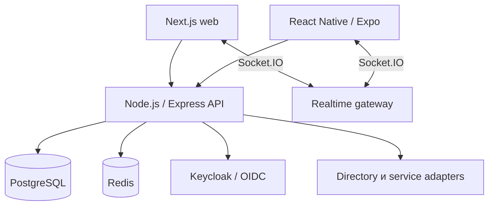

# Внутренняя платформа для сотрудников

Источник — приватная система. Здесь опубликованы только архитектурные доказательства и санитизированные описания.

## Задача

Сотрудникам требовалось единое аутентифицированное рабочее пространство: directory/profile, мессенджер, задачи, Service Desk, уведомления, onboarding, инфраструктурные self-service сценарии и настраиваемый desktop CRM. Система должна была иметь web- и Android-клиенты, интегрироваться с корпоративной identity-платформой и проходить управляемый путь от исходного кода до production.

## Ограничения

- Существующие directory, identity, file и VPN-системы должны были оставаться источниками истины в своих областях.
- Скрытие кнопки в UI не могло считаться authorization.
- Web, mobile, background notifications и realtime-состояние должны были одинаково трактовать identity и статусы delivery/read.
- Schema evolution требовалось выполнять безопасно для уже работающей установки.
- Staging и production должны были иметь раздельные identity, storage и mobile artifacts.
- Публичный кейс не раскрывает исходники, endpoints, внутреннюю topology и данные сотрудников.

## Архитектура и подход

Backend построен как modular monolith с общими слоями authentication, principal resolution, authorization, migrations, notifications и realtime. Модули, которым важны общие транзакции и простая эксплуатация, остаются в одной deployment boundary. Интеграции с внешними продуктами оформлены через adapters и не выдаются за самостоятельно разработанные компоненты.

## Что я реализовал

- REST endpoints и сервисы на Node.js/Express с PostgreSQL и Redis.
- Маппинг Keycloak/OIDC identity в application principal и employee record, capability checks и resource-level RBAC.
- Socket.IO-мессенджер: authenticated connections, комнаты пользователя и диалога, синхронизацию delivery/read, presence и reconnect.
- Рабочие пространства на Next.js/React и сценарии React Native/Expo с общими API contracts.
- Mobile Authorization Code + PKCE, secure token storage, согласованный refresh и session-aware lifecycle realtime-соединения.
- Последовательные PostgreSQL migrations с checksums, advisory lock, transaction boundaries и CI-проверкой на чистой schema.
- CRM: pipelines, stages, deals, activities, custom fields, permission-aware views, Kanban и optimistic UI.
- Раздельные staging/production contours на Docker Compose, Nginx routing, GitHub Actions, Playwright-проверки и release acceptance documentation.

## Ключевые инженерные решения

1. **Identity provider и application user — разные уровни.** Валидный IdP token сначала преобразуется в principal, затем разрешается в допустимую employee-запись. Успешная authentication сама по себе не даёт доступ к приложению.
2. **Realtime payload формируется для конкретного получателя.** Message event инициирует recipient-specific read вместо широковещательной отправки одного объекта с избыточными данными.
3. **История migrations неизменяема.** Для применённого SQL хранится checksum; изменение истории завершает запуск ошибкой. PostgreSQL advisory lock исключает конкурентную миграцию двумя instances.
4. **Source acceptance и runtime acceptance фиксируются отдельно.** Merge в production branch не описывается как работающая функция без deployment и acceptance evidence.
5. **Mobile socket следует состоянию приложения.** Клиент отключается при sign-out, offline и background; смена token уничтожает старое соединение до reconnect.

## Надёжность, безопасность и тестирование

- CI ищет распространённые credential signatures и запрещённые environment/build artifacts.
- Migrations дважды выполняются на чистом PostgreSQL: проверяется первичная установка и повторный запуск.
- Backend unit/integration tests охватывают authentication, messaging, tasks, Service Desk, notifications, mobile API и migrations.
- Playwright проверяет ключевые web-сценарии.
- Для mobile в CI предусмотрены lint, typecheck, unit tests, config validation и Android export.
- Production release связывается с точным Git commit, а mobile artifact — с checksum.

## Результат

Для общего ядра, employee directory, Messenger, Service Desk, notifications, onboarding, cloud entry и VPN workflows зафиксированы production-accepted baseline. CRM и более поздние HR/mobile изменения описаны осторожнее: их реализация и source-level verification подтверждены сильнее, чем независимый runtime acceptance каждой последующей revision.

## Что доказывает кейс

- Full-stack и mobile-разработку в одной продуктовой системе.
- Node.js/Express, React/Next.js, React Native/Expo, PostgreSQL, Redis и Socket.IO.
- OIDC/OAuth 2.0/PKCE, RBAC и server-side authorization.
- Проектирование migrations, CI/CD, staging/production separation и evidence-based release process.

Связанные примеры: [RBAC boundary](../../backend/rbac-boundary.ts), [migration runner](../../database/checksummed-migrations.ts), [mobile session manager](../../mobile/pkce-session-manager.ts).
