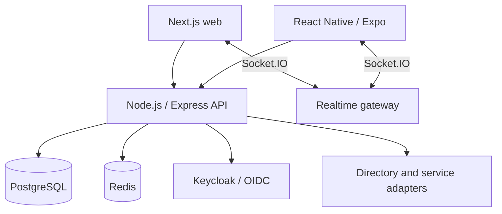

# Internal Employee Platform

Private source system. This case contains architecture-level evidence and sanitized descriptions only.

# Problem

Employees needed one authenticated workspace for directory/profile data, messaging, tasks, Service Desk, notifications, onboarding, infrastructure self-service, and a configurable desktop CRM. The system also needed web and Android clients, integration with corporate identity, and an operational path from source to production.

# Constraints

- Existing directory, identity, file, and VPN platforms had to remain authoritative where appropriate.
- Authorization could not rely on hidden UI controls.
- Web, mobile, background notifications, and realtime state had to agree on identity and read/unread semantics.
- Database evolution had to be safe for an already running installation.
- Staging and production identities, storage, and mobile artifacts had to remain separate.
- This public case cannot expose the source code, endpoints, internal topology, or employee data.

# Architecture / approach

The backend is a modular monolith with shared authentication, principal resolution, authorization, migrations, notifications, and realtime foundations. Domain modules remain inside one deployment boundary where cross-module transactions and operational simplicity are valuable. External products are integrated through explicit adapters rather than presented as authored components.

# My implementation

- Built backend REST endpoints and services on Node.js/Express with PostgreSQL and Redis.
- Implemented Keycloak/OIDC principal mapping, employee resolution, capability checks, and resource-level RBAC.
- Implemented Socket.IO messaging behavior including authenticated connections, per-user/per-conversation rooms, delivery/read synchronization, presence, and reconnect handling.
- Built Next.js/React workspaces and React Native/Expo flows sharing the same API contracts.
- Implemented mobile Authorization Code + PKCE, secure token storage, coordinated refresh, and session-aware realtime lifecycle.
- Designed sequential PostgreSQL migrations with checksums, advisory locking, transaction boundaries, and CI verification from a clean schema.
- Implemented CRM pipelines, stages, deals, activities, custom fields, permission-aware views, Kanban behavior, and optimistic UI updates.
- Built Docker Compose staging/production contours, Nginx routing, GitHub Actions checks, Playwright coverage, and release acceptance documentation.

# Interesting engineering decisions

1. **Principal and employee are separate concepts.** A valid identity-provider token is mapped to an application principal, then resolved to a permitted employee record. This prevents authentication from silently granting application access.
2. **Realtime payloads are projected per recipient.** Message events trigger recipient-specific reads rather than broadcasting one over-privileged object to every connected client.
3. **Migration history is immutable.** Applied SQL is checksummed; changed history fails fast. A PostgreSQL advisory lock prevents two application instances from migrating concurrently.
4. **Source acceptance and runtime acceptance are different facts.** A feature merged into the production branch is not described as live until deployment and acceptance evidence exists.
5. **Mobile sockets follow application state.** The client disconnects when signed out, offline, or backgrounded; token changes destroy the old socket before reconnecting.

# Reliability / security / testing

- CI checks common credential signatures and rejects tracked environment/build artifacts.
- Migrations run twice against a clean PostgreSQL service to verify installability and repeatability.
- Backend unit/integration tests cover authentication, messaging, tasks, Service Desk, notifications, mobile APIs, and migrations.
- Frontend Playwright tests cover major user workflows.
- Mobile lint, typecheck, unit tests, config validation, and Android export are scoped into CI.
- Production releases are tied to exact Git commits and immutable mobile artifacts with checksums.

# Result

The platform reached production-accepted baselines for the shared core, employee directory, Messenger, Service Desk, notifications, onboarding, cloud entry, and VPN workflows. Other modules, including CRM and later HR/mobile deltas, are described more conservatively where source acceptance is stronger than independently recorded runtime evidence.

# What this case demonstrates

- Full-stack and mobile product delivery.
- Node.js/Express, React/Next.js, React Native/Expo, PostgreSQL, Redis, and Socket.IO.
- OIDC/OAuth 2.0/PKCE, RBAC, and server-side authorization.
- Migration design, CI/CD, staging/production separation, and evidence-based release thinking.

Related samples: [RBAC boundary](../../backend/rbac-boundary.ts), [migration runner](../../database/checksummed-migrations.ts), [mobile session manager](../../mobile/pkce-session-manager.ts).

