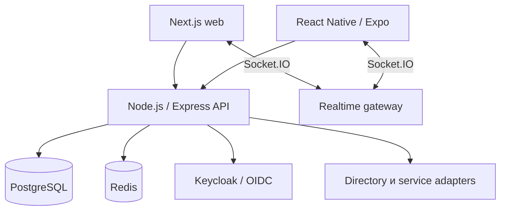

# Внутренняя платформа для сотрудников

Источник — приватная система. Здесь опубликованы только архитектурные доказательства и санитизированные описания.

## Роль и граница доказательства

| | |
|---|---|
| Моя роль | Архитектура и реализация backend, web/mobile-клиентов, интеграций, delivery и эксплуатационных процедур |
| Статус системы | Основное ядро и ряд модулей приняты в production; более поздние CRM/HR/mobile revisions имеют отдельно указанные границы acceptance |
| Реализовано лично | Перечисленные ниже API, auth/RBAC, realtime, migrations, интерфейсы, mobile session lifecycle и CI/CD |
| Публичная граница | Исходный продукт закрыт; доступны runnable reconstruction, сфокусированные samples и проверяемое описание maturity |

## Задача

Сотрудникам требовалось единое аутентифицированное рабочее пространство: справочник и профили, мессенджер, задачи, Service Desk, уведомления, onboarding, инфраструктурные self-service сценарии и настраиваемый desktop CRM. Система должна была иметь web- и Android-клиенты, интегрироваться с корпоративным контуром identity и проходить управляемый путь от исходного кода до production.

## Ограничения

- Существующие directory, identity, файловые и VPN-системы должны были оставаться источниками истины в своих областях.
- Скрытие кнопки в UI не могло заменять server-side authorization.
- Web, mobile, фоновые уведомления и realtime-состояние должны были одинаково трактовать пользователя и статусы delivery/read.
- Изменения схемы требовалось выполнять безопасно для уже работающей установки.
- Staging и production должны были иметь раздельные identity, хранилища и mobile artifacts.
- Публичный кейс не раскрывает исходники, endpoints, внутреннюю topology и данные сотрудников.

## Архитектура и подход

Backend построен как modular monolith с общими слоями authentication, разрешения principal, authorization, migrations, уведомлений и realtime. Модули, которым важны общие транзакции и простая эксплуатация, остаются в одной границе развёртывания. Интеграции с внешними продуктами оформлены через adapters и не выдаются за самостоятельно разработанные компоненты.

## Что я реализовал

- REST endpoints и сервисы на Node.js/Express с PostgreSQL и Redis.
- Маппинг Keycloak/OIDC identity в principal приложения и запись сотрудника, capability checks и resource-level RBAC.
- Socket.IO-мессенджер: authenticated connections, комнаты пользователя и диалога, синхронизацию delivery/read, presence и reconnect.
- Рабочие пространства на Next.js/React и сценарии React Native/Expo с общими API contracts.
- Mobile Authorization Code + PKCE, защищённое хранение token, согласованный refresh и lifecycle realtime-соединения с учётом сессии.
- Последовательные PostgreSQL migrations с checksums, advisory lock, transaction boundaries и CI-проверкой на чистой schema.
- CRM: pipelines, stages, deals, activities, custom fields, permission-aware views, Kanban и optimistic UI.
- Раздельные staging/production contours на Docker Compose, Nginx routing, GitHub Actions, Playwright-проверки и release acceptance documentation.

## Ключевые инженерные решения

1. **Identity provider и пользователь приложения — разные уровни.** Валидный IdP token сначала преобразуется в principal, затем сопоставляется с допустимой записью сотрудника. Успешная authentication сама по себе не даёт доступа к приложению.
2. **Realtime payload формируется для конкретного получателя.** Message event инициирует recipient-specific read вместо широковещательной отправки одного объекта с избыточными данными.
3. **История migrations неизменяема.** Для применённого SQL хранится checksum; изменение истории завершает запуск ошибкой. PostgreSQL advisory lock исключает конкурентную миграцию двумя instances.
4. **Приёмка кода и проверка в рабочей среде фиксируются отдельно.** Merge в production branch не означает, что функция развёрнута и принята пользователями.
5. **Mobile socket следует состоянию приложения.** Клиент отключается при sign-out, offline и background; смена token уничтожает старое соединение до reconnect.

### Реальное изменение после проверки runtime

Первоначально любой refresh failure очищал mobile session. Нестабильная сеть тем самым превращала временный сбой в принудительный logout. Исправление разделило terminal OAuth errors (`invalid_grant`, `invalid_token`) и transient network failures: только первые уничтожают сохранённую сессию. Отдельный test подтверждает, что при сетевой ошибке refresh token остаётся в secure storage. Это изменение вошло в accepted mobile runtime baseline.

## Надёжность, безопасность и тестирование

- CI ищет распространённые credential signatures и запрещённые environment/build artifacts.
- Migrations дважды выполняются на чистом PostgreSQL: проверяется первичная установка и повторный запуск.
- Backend unit/integration tests охватывают authentication, messaging, tasks, Service Desk, notifications, mobile API и migrations.
- Playwright проверяет ключевые web-сценарии.
- Для mobile в CI предусмотрены lint, typecheck, unit tests, config validation и Android export.
- Production release связывается с точным Git commit, а mobile artifact — с checksum.

## Результат

Для общего ядра, справочника сотрудников, Messenger, Service Desk, уведомлений, onboarding, cloud entry и VPN-сценариев зафиксированы принятые в production baseline. CRM и более поздние HR/mobile изменения описаны осторожнее: их реализация и проверка исходного кода подтверждены сильнее, чем независимая приёмка каждой последующей revision в рабочей среде.

## Что доказывает кейс

- Full-stack и mobile-разработку в одной продуктовой системе.
- Node.js/Express, React/Next.js, React Native/Expo, PostgreSQL, Redis и Socket.IO.
- OIDC/OAuth 2.0/PKCE, RBAC и server-side authorization.
- Проектирование migrations, CI/CD, staging/production separation и evidence-based release process.

## Публичные артефакты

- [Reference service](../../examples/reference-service/README.md) — real PostgreSQL, migrations, permission boundary и integration tests.
- [Migration runner](../../database/checksummed-migrations.ts) — checksum history и advisory lock.
- [Mobile session manager](../../mobile/pkce-session-manager.ts) — terminal/transient refresh boundary.
- [CI workflow](../../.github/workflows/validate.yml) — standalone demo действительно собирается и тестируется.
