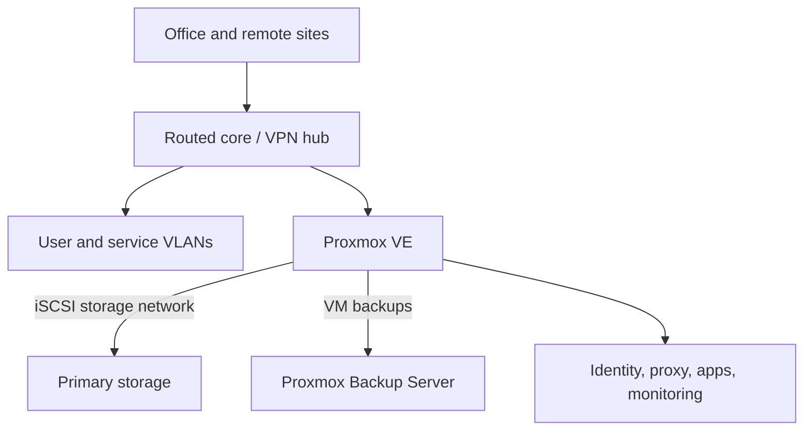

# Infrastructure, Backup, and Disaster Recovery

This case is fully sanitized. Names, addresses, site identities, inventory, capacities, and exact topology are omitted.

# Problem

A growing multi-site environment needed a coherent network, virtualization and storage platform, centralized identity, monitored services, verified backups, and operational documentation that could support real incidents rather than only describe an ideal state.

# Constraints

- The environment contained legacy dependencies and single points of failure.
- Storage for virtual machines crossed the compute/storage network through iSCSI.
- Backup infrastructure also carried other operational responsibilities.
- Remote changes needed alternate access and explicit rollback.
- Existing unknowns could not be silently guessed during documentation.

# Architecture / approach

The design separates user, server, management, guest, voice, CCTV, and storage/backup traffic. The documentation links architecture, inventory references, runbooks, troubleshooting, change records, and technical debt while keeping secrets and device exports outside Git.

# My implementation

- Designed and built the physical/server environment, switching, routing, VLANs, firewall/NAT, Wi-Fi separation, and site-to-site VPN connectivity.
- Deployed and operated Proxmox VE, Proxmox Backup Server, TrueNAS, iSCSI-backed storage, Active Directory/DNS, Linux services, containers, and monitoring.
- Established backup retention, verification, and an isolated end-to-end VM restore drill.
- Wrote dependency-ordered disaster recovery procedures for compute, storage, identity, network, and application recovery.
- Introduced change cards with pre-checks, success criteria, rollback triggers, post-checks, and documentation updates.
- Documented incident severity, first-response workflow, evidence preservation, recovery verification, and follow-up.
- Investigated a storage degradation incident across hypervisor, iSCSI, ZFS, kernel memory, switching, and dependent application layers.

# Interesting engineering decisions

1. **A running VM is not proof of healthy storage.** Guest I/O, kernel timeouts, and business functions are checked independently of hypervisor state.
2. **Restore begins isolated.** A backup is restored to a new identity with its network disconnected before boot and application checks.
3. **Dependencies determine recovery order.** Network/storage precede virtual machines; identity/DNS and databases precede dependent applications.
4. **Unknown is a valid documented state.** Missing RPO/RTO, backup scope, or restore proof becomes a tracked gap rather than an invented assurance.
5. **Minimal reversible change first.** Incidents do not justify simultaneous changes across network, storage, and application layers.

# Reliability / security / testing

- Backup checks include job result, retention behavior, datastore capacity, and scheduled verification.
- The restore drill proves the chain from backup job through snapshot read, disk/config restore, isolated boot, and guest activity.
- Stateful services still require separate application-consistency tests; infrastructure restore is not misrepresented as database consistency proof.
- Commands are classified as read-only or configuration-changing, and sensitive exports are explicitly excluded from documentation.

# Result

The environment gained a usable operational source of truth, repeatable change/incident methods, and a verified infrastructure-level restore path. The documentation also made remaining single points of failure and unverified recovery boundaries visible for prioritization.

# What this case demonstrates

- Linux and production operations.
- Network segmentation, routing, VPN, virtualization, storage, backup, and DR.
- Cross-layer incident diagnosis and evidence-based root-cause analysis.
- Runbook, change-management, and operational documentation design.

Related documents: [backup and restore runbook](../../infrastructure/backup-restore-runbook.md), [sanitized incident analysis](../../infrastructure/incident-analysis.md).

