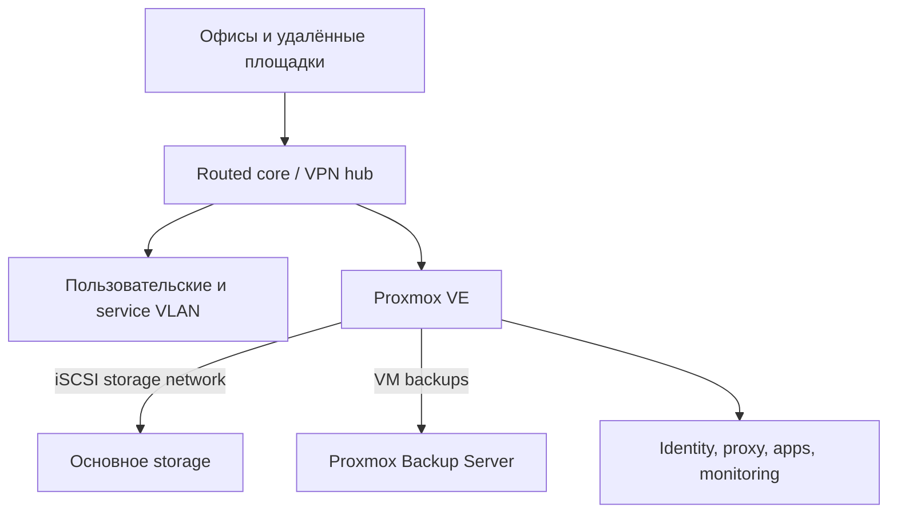

# Инфраструктура, backup и disaster recovery

Кейс полностью санитизирован: названия, адреса, площадки, inventory, capacity и точная topology исключены.

## Задача

Растущей multi-site среде требовалась согласованная сеть, платформа виртуализации и storage, централизованная identity, monitoring, проверяемые backups и эксплуатационная документация, пригодная для реального incident, а не только для описания идеального состояния.

## Ограничения

- В среде были legacy-зависимости и single points of failure.
- Storage виртуальных машин передавался между compute и storage через iSCSI.
- Backup infrastructure выполняла и другие операционные функции.
- Remote changes требовали alternate access и явно определённого rollback.
- Пробелы в сведениях нельзя было незаметно заполнять предположениями.

## Архитектура и подход

Архитектура разделяет user, server, management, guest, voice, CCTV и storage/backup traffic. Документация связывает architecture, inventory references, runbook’и, troubleshooting, change records и technical debt, при этом secrets и device exports хранятся вне Git.

## Что я реализовал

- Спроектировал и развернул server/physical environment, switching, routing, VLAN, firewall/NAT, разделение Wi-Fi и site-to-site VPN.
- Развернул и сопровождал Proxmox VE, Proxmox Backup Server, TrueNAS, iSCSI storage, Active Directory/DNS, Linux services, containers и monitoring.
- Настроил backup retention, verification и изолированную end-to-end проверку восстановления VM.
- Описал dependency-ordered disaster recovery для compute, storage, identity, network и applications.
- Ввёл change cards с pre-checks, success criteria, rollback triggers, post-checks и обязательным обновлением документации.
- Формализовал incident severity, first response, сохранение evidence, проверку recovery и follow-up.
- Провёл cross-layer анализ storage degradation: hypervisor, iSCSI, ZFS, kernel memory, switching и зависимые application layers.

## Ключевые инженерные решения

1. **Запущенная VM не доказывает здоровье storage.** Guest I/O, kernel timeouts и бизнес-функции проверяются независимо от состояния hypervisor.
2. **Restore начинается в изоляции.** Backup восстанавливается с новым identity и отключённой сетью до первого boot и application checks.
3. **Recovery order задаётся зависимостями.** Network/storage предшествуют VM, identity/DNS и databases — зависимым applications.
4. **«Неизвестно» — допустимое документированное состояние.** Отсутствующие RPO/RTO, backup scope или restore evidence становятся отслеживаемым gap, а не выдуманной гарантией.
5. **Сначала минимальное обратимое изменение.** Incident не оправдывает одновременное изменение network, storage и application layers.

## Надёжность, безопасность и тестирование

- Backup checks включают результат job, retention behavior, datastore capacity и scheduled verification.
- Restore drill проверяет цепочку от backup job и чтения snapshot до восстановления disks/config, isolated boot и guest activity.
- Для stateful services отдельно нужны application-consistency tests; infrastructure restore не выдаётся за доказательство database consistency.
- Команды классифицированы как read-only или configuration-changing, а sensitive exports явно исключены из документации.

## Результат

У среды появился пригодный для эксплуатации источник истины, повторяемые методы change/incident и проверенная infrastructure-level цепочка восстановления. Документация также сделала видимыми remaining single points of failure и непроверенные recovery boundaries, чтобы их можно было приоритизировать.

## Что доказывает кейс

- Linux и эксплуатацию production-среды.
- Network segmentation, routing, VPN, virtualization, storage, backup и DR.
- Cross-layer incident diagnosis и evidence-based root-cause analysis.
- Проектирование runbook, change management и operational documentation.

Связанные документы: [runbook backup/restore](../../infrastructure/backup-restore-runbook.md), [санитизированный incident analysis](../../infrastructure/incident-analysis.md).
