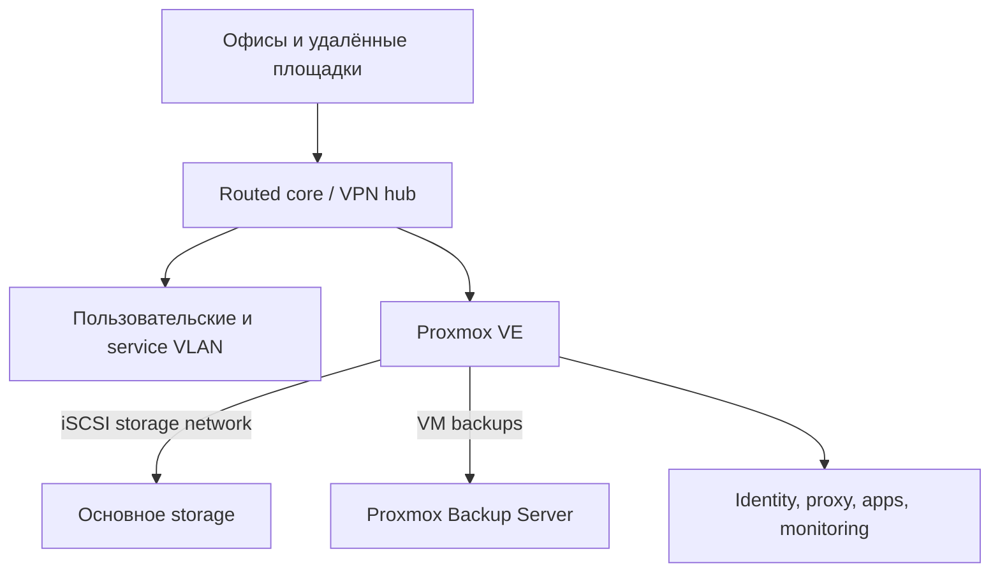

# Инфраструктура, backup и disaster recovery

Кейс полностью санитизирован: названия, адреса, площадки, inventory, capacity и точная topology исключены.

## Роль и граница доказательства

| | |
|---|---|
| Моя роль | Проектирование, развёртывание и эксплуатация сети, virtualization/storage, backup и operational documentation |
| Статус системы | Production infrastructure; public case не раскрывает точную topology и inventory |
| Реализовано лично | VLAN/routing/VPN, Proxmox VE/PBS, TrueNAS/iSCSI, monitoring, restore drill, incident/change procedures |
| Публичная граница | Доступны санитизированные runbook и incident analysis; фактические commands, IP, VM IDs и capacity удалены |

## Задача

Растущей multi-site среде требовались согласованные сеть, виртуализация и storage, централизованная identity, monitoring, проверяемые backups и эксплуатационная документация, пригодная для реального incident, а не только для описания идеального состояния.

## Ограничения

- В среде были legacy-зависимости и single points of failure.
- Storage виртуальных машин передавался между compute и storage через iSCSI.
- Backup infrastructure выполняла и другие операционные функции.
- Удалённые изменения требовали резервного канала доступа и заранее определённого rollback.
- Пробелы в сведениях нельзя было незаметно заполнять предположениями.

## Архитектура и подход

Архитектура разделяет пользовательский, серверный, management, guest, voice, CCTV и storage/backup traffic. Документация связывает схему, ссылки на inventory, runbook’и, troubleshooting, change records и technical debt, при этом secrets и device exports хранятся вне Git.

## Что я реализовал

- Спроектировал и развернул server/physical environment, switching, routing, VLAN, firewall/NAT, разделение Wi-Fi и site-to-site VPN.
- Развернул и сопровождал Proxmox VE, Proxmox Backup Server, TrueNAS, iSCSI storage, Active Directory/DNS, Linux services, containers и monitoring.
- Настроил backup retention, verification и изолированную end-to-end проверку восстановления VM.
- Описал порядок disaster recovery по зависимостям между compute, storage, identity, сетью и приложениями.
- Ввёл change cards с pre-checks, success criteria, rollback triggers, post-checks и обязательным обновлением документации.
- Формализовал incident severity, first response, сохранение evidence, проверку recovery и follow-up.
- Провёл cross-layer анализ storage degradation: hypervisor, iSCSI, ZFS, kernel memory, switching и зависимые application layers.

## Ключевые инженерные решения

1. **Запущенная VM не доказывает здоровье storage.** Guest I/O, kernel timeouts и бизнес-функции проверяются независимо от статуса в hypervisor.
2. **Restore начинается в изоляции.** Backup восстанавливается с новым identity и отключённой сетью до первого boot и application checks.
3. **Порядок восстановления задаётся зависимостями.** Сеть и storage предшествуют VM, identity/DNS и базы данных — зависимым приложениям.
4. **«Неизвестно» — допустимое документированное состояние.** Отсутствующие RPO/RTO, backup scope или restore evidence становятся отслеживаемым gap, а не выдуманной гарантией.
5. **Сначала минимальное обратимое изменение.** Incident не оправдывает одновременное изменение сети, storage и приложений.

### Реальный incident и corrective change

Несколько VM оставались `running`, но guest I/O остановился. Healthy ZFS pool и активная iSCSI session сначала выглядели как признаки исправного storage. Сопоставление SCST allocation errors с initiator timeouts показало отказ именно в request path. Вместо одновременной перестройки storage/network был введён один обратимый ARC limit, освобождающий memory headroom для kernel/SCST. Проверка подтвердила новое значение limit, рост доступной памяти, прекращение новых allocation errors за окно наблюдения и восстановление зависимых путей. Полная первопричина kernel allocation честно осталась недоказанной из-за отсутствия memory snapshot в момент аварии.

## Надёжность, безопасность и тестирование

- Проверка backup включает результат job, соблюдение retention, capacity datastore и запланированную verification.
- Restore drill проверяет цепочку от backup job и чтения snapshot до восстановления disks/config, isolated boot и guest activity.
- Для stateful services отдельно нужны application-consistency tests; infrastructure restore не выдаётся за доказательство database consistency.
- Команды классифицированы как read-only или configuration-changing, а sensitive exports явно исключены из документации.

## Результат

У среды появился пригодный для эксплуатации источник истины, повторяемые процедуры change/incident и проверенная на инфраструктурном уровне цепочка восстановления. Документация также сделала видимыми оставшиеся single points of failure и непроверенные границы recovery, чтобы их можно было приоритизировать.

## Что доказывает кейс

- Linux и эксплуатацию production-среды.
- Network segmentation, routing, VPN, virtualization, storage, backup и DR.
- Cross-layer incident diagnosis и evidence-based root-cause analysis.
- Проектирование runbook, change management и operational documentation.

## Публичные артефакты

- [Runbook backup/restore](../../infrastructure/backup-restore-runbook.md) — порядок isolated restore, stop conditions и evidence record.
- [Incident analysis](../../infrastructure/incident-analysis.md) — evidence chain, corrective change и граница доказанной root cause.
