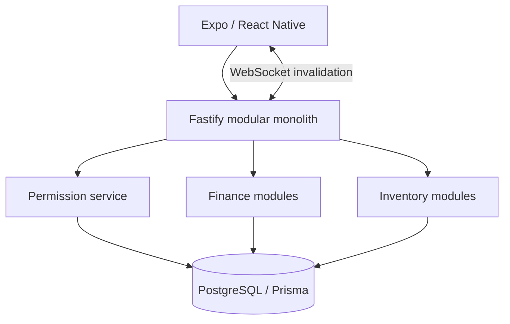

# Мультитенантная система финансов и учёта

Источник — приватный личный продукт. Финансовые данные пользователей и deployment secrets не публикуются.

## Роль и граница доказательства

| | |
|---|---|
| Моя роль | Архитектура и реализация TypeScript monorepo: Fastify API, Prisma/PostgreSQL и React Native/Expo client |
| Статус системы | Опубликован alpha baseline; inventory/production развивался последующими feature revisions и не называется зрелым production |
| Реализовано лично | Модели данных, permission service, атомарные financial/inventory operations, sessions, WebSocket invalidation и mobile flows |
| Публичная граница | User finance data и полный domain code закрыты; tenant/idempotency path воспроизведён в минимальном runnable service |

## Задача

Одно приложение должно было поддерживать личные, совместные и небольшие бизнес-финансы без ослабления tenant isolation и финансовой корректности. Последующий бизнес-модуль добавил каталог, точки хранения, производство, перемещения, продажи, списания, оценку остатков и атомарную связь физической продажи с финансовым доходом.

## Ограничения

- Денежные величины нельзя хранить в floating point.
- Membership в одном `space` не должна давать доступ к другому.
- Баланс счёта и история операций не могут расходиться.
- Повтор mutation не должен дублировать запись ledger.
- Остаток — это результат проверяемого movement ledger, а не редактируемое число.
- Mobile realtime не становится вторым источником истины.

## Архитектура и подход

Система организована как pnpm/Turborepo monorepo: Fastify API, Prisma/PostgreSQL data layer, Expo client и общие TypeScript contracts/utilities. Modular monolith сохраняет транзакционные границы, не смешивая домены логически.

## Что я реализовал

- Модели tenant, `space`, membership, invitation, счетов, операций, планирования, аудита, export, inventory и production.
- Централизованные permission checks для конкретного space на backend, без доверия route parameters и client state.
- Хранение денег в integer minor units (`BIGINT`) и сериализацию строками через JSON boundary.
- Создание финансовой операции с validation, изменениями балансов, splits, audit record и idempotency record в одной Prisma transaction.
- Inventory documents и immutable movements, включая lot-aware stock allocation и связь sale с income.
- JWT access tokens, opaque refresh sessions, hashing/rotation tokens, hashing invitations и redaction structured logs.
- Authenticated WebSocket events; mobile client инвалидирует TanStack Query cache и заново получает авторитетное состояние.
- React Native/Expo flows для finance, analytics, spaces, members, exports и inventory operations.

## Ключевые инженерные решения

1. **`Space` — самостоятельная permission boundary.** Верхнеуровневый family/tenant container не даёт доступа ко всем spaces: каждый request проверяет активную membership в точном scope.
2. **Баланс изменяется вместе с ledger.** Строка операции, splits, изменения баланса, audit и idempotency record фиксируются одной database transaction.
3. **Остаток выводится из movements.** Проведённый документ создаёт signed immutable movements; draft не влияет на остатки.
4. **Realtime передаёт invalidation, а не готовое состояние.** Event сообщает, что изменилось, после чего клиент выполняет authorized API query.
5. **Одноразовый invitation обеспечивается атомарно.** Код возвращается открытым текстом один раз, хранится как hash, имеет срок действия и не допускает replay.

### Trade-off: `Family` не стала неявным пропуском во все `Space`

Было бы проще проверять только membership в верхнеуровневом tenant, но тогда доступ к одному совместному контуру мог открыть другой. Permission service проверяет активную membership именно в `spaceId` из request. Integration/E2E suite использует двух пользователей и outsider для проверки permissions и IDOR; публичный reference service повторяет эту границу на вымышленных данных.

## Надёжность, безопасность и тестирование

- CI выполняет Prisma validation/deploy, lint, typecheck, unit tests, build и проверки с PostgreSQL.
- Integration/E2E tests проверяют несколько пользователей, invitations, replay/expiry/revoke, permission и IDOR boundaries, transfers, budgets, analytics, multi-currency и export security.
- Check constraints и foreign keys защищают document lifecycle, locations, quantities и financial linkage.
- Upload endpoints остаются выключенными, пока нет file-signature validation и безопасного storage adapter.

## Результат

Реализованы alpha-функции совместных финансов и business-модуль inventory/production с атомарной финансовой связью. В исходном репозитории отделены released alpha baseline и последующие feature-ветки; roadmap не выдаётся за завершённую работу, а система — за зрелый production deployment.

## Что доказывает кейс

- TypeScript, Fastify, Prisma, PostgreSQL, React Native/Expo, pnpm и Turborepo.
- Multi-tenant authorization и security testing.
- Моделирование finance/inventory domain и атомарные операции.
- WebSocket-driven cache invalidation при API как source of truth.

## Публичные артефакты

- [Reference service](../../examples/reference-service/README.md) — запускаемая exact-space boundary, idempotency и PostgreSQL integration tests.
- [Atomic ledger](../../database/atomic-ledger.ts) — одна transaction для resource, balance, audit и idempotency record.
- [Realtime invalidation](../../mobile/realtime-invalidation.ts) — event инвалидирует cache, API остаётся источником истины.
