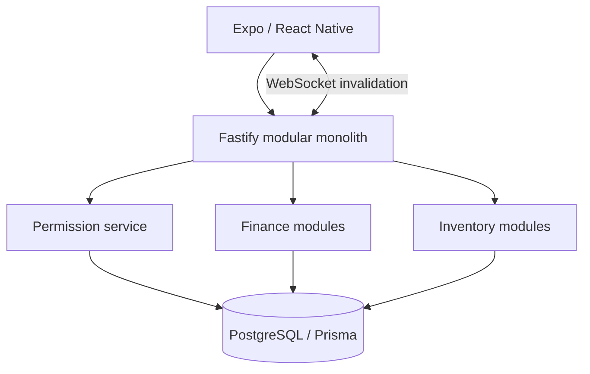

# Multi-tenant Finance and Inventory Platform

Private personal product. No user financial data or deployment secrets are published.

# Problem

One application needed to support personal, shared, and small-business finance without weakening tenant isolation or financial correctness. A later business domain added catalogue, locations, production, transfers, sales, write-offs, stock valuation, and an atomic link between a physical sale and financial income.

# Constraints

- Money cannot use floating-point arithmetic.
- Membership in one shared space must never grant access to another.
- Account balances and transaction history must not diverge.
- Retried mutations must not duplicate ledger entries.
- Stock is an auditable movement ledger, not an editable number.
- Mobile realtime updates must not become a second source of truth.

# Architecture / approach

The system is a pnpm/Turborepo monorepo with a Fastify API, Prisma/PostgreSQL data layer, Expo client, and shared TypeScript contracts/utilities. A modular monolith preserves transactional boundaries while keeping domains explicit.

# My implementation

- Modeled tenant, space, membership, invitation, account, transaction, planning, audit, export, inventory, and production domains.
- Centralized exact-space permission checks in a backend service rather than trusting route parameters or client state.
- Stored money as integer minor units (`BIGINT`) and serialized it as strings across JSON boundaries.
- Implemented transaction creation with input validation, account deltas, splits, audit records, and idempotency records inside one Prisma transaction.
- Built inventory documents and immutable movements, including lot-aware stock allocation and sale-to-income linkage.
- Implemented JWT access tokens, opaque refresh sessions, token hashing/rotation, invitation hashing, and structured-log redaction.
- Added authenticated WebSocket events; the mobile client invalidates TanStack Query caches and refetches authoritative state.
- Built React Native/Expo flows for finance, analytics, spaces, members, exports, and inventory operations.

# Interesting engineering decisions

1. **Space is the permission boundary.** A higher-level family/tenant container does not imply access to every space; each request verifies active membership in the exact resource scope.
2. **Balances are updated with the ledger.** Transaction row, splits, cached account deltas, audit record, and idempotency record share one database transaction.
3. **Stock is derived from movements.** Posted documents create signed immutable movement rows; draft edits do not affect balances.
4. **Realtime sends invalidation, not replacement state.** The WebSocket identifies what changed, and the client refetches through authorized API queries.
5. **Single-use invitations are enforced atomically.** Plaintext codes are returned once, stored as hashes, expire, and reject replay.

# Reliability / security / testing

- CI runs Prisma validation/deploy, lint, typecheck, unit tests, build, and PostgreSQL-backed checks.
- Integration/E2E coverage exercises multiple users, invitations, replay/expiry/revoke, permission and IDOR boundaries, transfers, budgets, analytics, multi-currency, and export security.
- The schema uses check constraints and foreign keys for document lifecycle, locations, quantities, and financial linkage.
- Upload endpoints stay disabled until file-signature validation and a safe storage adapter exist.

# Result

The implemented platform covers shared financial operations and a business inventory/production slice with atomic finance linkage. The repository clearly separates released alpha functionality from later feature branches and does not present roadmap items as completed work.

# What this case demonstrates

- TypeScript, Fastify, Prisma, PostgreSQL, React Native/Expo, pnpm, and Turborepo.
- Multi-tenant authorization and security testing.
- Financial/inventory domain modeling and atomic operations.
- WebSocket-driven cache invalidation with the API as source of truth.

Related samples: [atomic ledger](../../database/atomic-ledger.ts), [tenant RBAC](../../backend/rbac-boundary.ts), [realtime invalidation](../../mobile/realtime-invalidation.ts).

