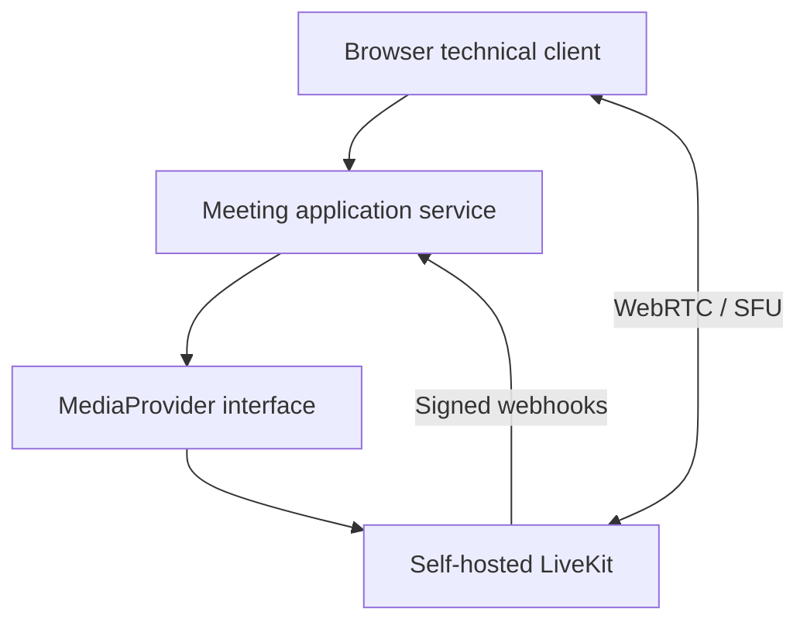

# Self-hosted Realtime Meetings Prototype

Status: validated LAN technical prototype, not a production conferencing claim.

# Problem

An internal communications platform needed an evaluated path to self-hosted audio/video meetings that could keep LAN meetings independent of WAN availability and avoid coupling product entities directly to a media vendor.

# Constraints

- Media networking differs from ordinary reverse-proxied HTTP.
- A single-node first phase needed a deliberately small operational footprint.
- Browser tokens must not expose media-provider API secrets.
- Presence must come from trusted provider events, not from token issuance or client claims.
- The available acceptance hardware did not complete trusted HTTPS/WSS microphone and camera testing.

# Architecture / approach

The application owns meeting and participant lifecycle. LiveKit is a replaceable SFU/media provider. The adapter creates rooms, issues short-lived room-bound grants, and verifies signed presence webhooks.

# My implementation

- Built a reproducible Docker Compose baseline for self-hosted LiveKit and a TypeScript technical client/token service.
- Added provider abstraction so domain code does not import LiveKit concerns.
- Implemented meeting lifecycle operations: create, start, add participant, issue grant, record join/leave, and end.
- Added signed webhook handling for participant joined/left/connection-aborted events.
- Added validation, rate limiting, tests, CI, diagnostics, health checks, backup/restore, deployment, networking, security, and rollback documentation.
- Ran LAN acceptance for media-less clients, multiple participants, inter-VLAN paths, direct UDP transport, and operation with WAN disconnected.

# Interesting engineering decisions

1. **Token issuance is not presence.** A participant becomes joined only after a verified provider webhook.
2. **Provider IDs remain external IDs.** Domain UUIDs and lifecycle are not replaced by LiveKit room/participant models.
3. **Redis was omitted intentionally.** On a single node it would add an operational dependency without removing the node failure domain.
4. **TURN was deferred intentionally.** Managed-LAN routing used direct SFU media paths; external guests require a separate exposure and TURN design.
5. **WAN independence was tested, not assumed.** New room creation and multi-participant signaling were exercised after WAN access was removed.

# Reliability / security / testing

- Browser clients receive only short-lived participant grants; API secrets remain server-side.
- Automated tests cover application service transitions, validation, media adapter, and HTTP behavior.
- CI validates TypeScript, tests, build, Compose configuration, YAML, and secret/file rules.
- Single-node restart loses transient meetings; this limitation is explicit.
- Real microphone/camera, trusted HTTPS/WSS, mute/camera controls, and A/V reconnect remain unaccepted and are not claimed.

# Result

The prototype proved the LAN signaling and transport path, provider abstraction, application lifecycle, and trusted presence mechanism. It also produced a precise list of blockers before production integration.

# What this case demonstrates

- LiveKit/WebRTC/SFU and network-aware application design.
- TypeScript service boundaries and provider adapters.
- Honest acceptance boundaries, diagnostics, and operational documentation.
