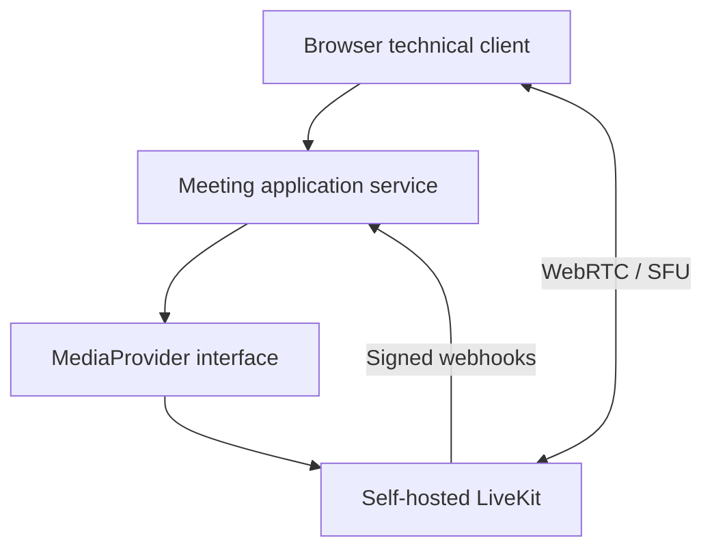

# Self-hosted realtime-встречи

Статус: проверенный LAN technical prototype, не production-сервис видеоконференций.

## Задача

Для внутренней коммуникационной платформы требовалось проверить self-hosted audio/video встречи, способные работать в LAN независимо от доступности WAN, и не связывать доменные сущности напрямую с моделью media provider.

## Ограничения

- Media networking отличается от обычного HTTP за reverse proxy.
- Первый single-node этап должен был иметь небольшой и понятный эксплуатационный контур.
- Browser token не должен раскрывать API secret media provider.
- Presence определяется доверенными событиями provider, а не фактом выдачи token или утверждением клиента.
- Доступное acceptance-оборудование не позволило завершить trusted HTTPS/WSS тесты microphone/camera.

## Архитектура и подход

Приложение владеет lifecycle встречи и участника. LiveKit используется как заменяемый SFU/media provider. Adapter создаёт комнаты, выдаёт короткоживущие grants с доступом к одной комнате и проверяет подписанные presence webhooks.

## Что я реализовал

- Воспроизводимый Docker Compose baseline для self-hosted LiveKit и TypeScript technical client/token service.
- Provider abstraction, изолирующую доменный код от LiveKit.
- Lifecycle встречи: create, start, add participant, issue grant, record join/leave и end.
- Обработку подписанных webhooks для participant joined/left/connection-aborted events.
- Validation, rate limiting, tests, CI, diagnostics, health checks и документацию по backup/restore, deployment, networking, security и rollback.
- LAN acceptance для media-less clients, нескольких participants, inter-VLAN path, direct UDP transport и работы при отключённом WAN.

## Ключевые инженерные решения

1. **Выдача token не равна presence.** Участник считается вошедшим только после проверенного provider webhook.
2. **Provider IDs остаются внешними идентификаторами.** Доменные UUID и lifecycle не заменяются room/participant models LiveKit.
3. **Redis намеренно не добавлен.** На одном node он увеличил бы operational dependency, не устранив общий failure domain.
4. **TURN намеренно отложен.** В управляемой LAN использовался прямой SFU media path; внешние участники требуют отдельного exposure/TURN design.
5. **WAN independence проверена экспериментом.** После отключения WAN создавались новые rooms и продолжался multi-participant signaling.

## Надёжность, безопасность и тестирование

- Browser получает только короткоживущий grant участника; API secrets остаются server-side.
- Automated tests покрывают application service transitions, validation, media adapter и HTTP behavior.
- CI проверяет TypeScript, tests, build, Compose configuration, YAML и secret/file rules.
- При перезапуске single-node transient meetings теряются; это ограничение зафиксировано явно.
- Real microphone/camera, trusted HTTPS/WSS, mute/camera controls и A/V reconnect не прошли acceptance и не заявляются готовыми.

## Результат

Prototype подтвердил LAN signaling/transport path, provider abstraction, lifecycle приложения и доверенный механизм presence. Одновременно сформирован точный список blockers до production integration.

## Что доказывает кейс

- LiveKit/WebRTC/SFU и network-aware application design.
- TypeScript service boundaries и provider adapters.
- Честную фиксацию acceptance boundaries, diagnostics и operational documentation.
