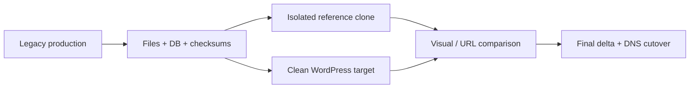

# WordPress Migration Platform

Private operational source. Domains, hosts, paths, credentials, and customer content are removed.

# Problem

Several legacy websites were distributed across hosting providers and old CMS stacks. The goal was to create an isolated, repeatable WordPress migration platform that preserved content and URLs without carrying unsupported legacy runtimes into the new production environment.

# Constraints

- The live site remained the source of truth until cutover.
- Some sources depended on old PHP, themes, builders, or multi-site coupling.
- Discovery and snapshot work could not mutate production.
- Visual reconstruction had to use evidence from the source, not invented content.
- Each target site needed independent runtime, database, backups, and rollback.

# Architecture / approach

Each target uses its own Docker Compose project, MariaDB database, webroot, and loopback-bound backend behind Nginx. Legacy clones exist only as isolated visual/data references.

# My implementation

- Audited hosting, DNS, CMS, database, and file sources and established an evidence hierarchy.
- Created canonical snapshots with database dumps, file copies, metadata, and checksums.
- Built an isolated legacy reference runtime where required for visual comparison.
- Built clean WordPress/PHP/MariaDB targets and custom themes instead of copying obsolete core/theme/plugin stacks.
- Migrated media and mapped legacy identifiers where necessary.
- Preserved URL structures and created content types/templates based on verified source behavior.
- Documented final snapshot/delta, smoke tests, rollback points, and DNS cutover rules.

# Interesting engineering decisions

1. **Reference clone is not the new platform.** It is disposable evidence for comparison, never the target runtime.
2. **Content and behavior are separated from legacy implementation.** URLs, media, and rendered output can be preserved without importing vulnerable builders and plugins.
3. **Every site is isolated.** Shared legacy multi-site coupling is removed so one update or failure does not implicitly affect another site.
4. **Cutover uses fresh evidence.** A historical snapshot starts the migration, but a final delta is required before DNS changes.

# Reliability / security / testing

- Database dumps and file archives are checksummed.
- A clean rollback point exists before content migration.
- PHP syntax, asset availability, URL status, visual behavior, forms, and SEO redirects are acceptance targets.
- Secrets belong in a vault; the repository contains only access references and verification dates.
- Backend services are bound to loopback and published through the reverse proxy.

# Result

The pilot produced a functioning clean WordPress runtime, migrated media and URL structures, reconstructed key pages from verified source content, and established a repeatable method for the remaining sites. Final cutover remains gated by visual acceptance and a fresh production delta.

# What this case demonstrates

- Nginx, PHP, MariaDB, WordPress, Docker Compose, and Linux operations.
- Safe legacy migration, evidence capture, staging, rollback, and DNS cutover thinking.
- Separation of content fidelity from technical debt.

