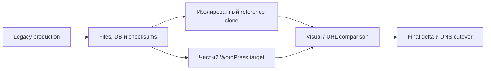

# Платформа миграции WordPress

Источник — приватный operational repository. Domains, hosts, paths, credentials и customer content удалены.

## Задача

Несколько legacy-сайтов находились у разных hosting providers и использовали устаревшие CMS stacks. Требовалось создать изолированную, повторяемую платформу миграции WordPress, сохранив контент и URLs, но не перенося неподдерживаемый legacy runtime в новую production-среду.

## Ограничения

- Live site оставался источником истины до cutover.
- Часть источников зависела от старых PHP, themes, builders или multi-site coupling.
- Discovery и snapshot не должны были изменять production.
- Визуальная реконструкция опиралась только на evidence из источника, без придуманного контента.
- Каждому целевому сайту требовались отдельные runtime, database, backups и rollback.

## Архитектура и подход

Каждый целевой сайт использует отдельный Docker Compose project, MariaDB, webroot и loopback-bound backend за Nginx. Legacy clones существуют только как изолированные reference environment для сравнения данных и внешнего вида.

## Что я реализовал

- Аудит hosting, DNS, CMS, database и файловых источников с явной иерархией evidence.
- Canonical snapshots: database dumps, file copies, metadata и checksums.
- Изолированный legacy reference runtime там, где он требовался для visual comparison.
- Чистые WordPress/PHP/MariaDB targets и custom themes без копирования устаревших core/theme/plugin stacks.
- Перенос media и mapping legacy identifiers, где это требовалось.
- Сохранение структуры URL и content types/templates по проверенному поведению источника.
- Правила final snapshot/delta, smoke tests, rollback points и DNS cutover.

## Ключевые инженерные решения

1. **Reference clone не становится новой платформой.** Это одноразовое evidence для сравнения, а не target runtime.
2. **Контент и поведение отделены от legacy implementation.** URLs, media и rendered output сохраняются без переноса уязвимых builders/plugins.
3. **Каждый сайт изолирован.** Удаляется legacy multi-site coupling, при котором обновление или отказ одного сайта влияет на другой.
4. **Cutover использует свежие данные.** Исторический snapshot запускает миграцию, но перед изменением DNS обязателен final delta.

## Надёжность, безопасность и тестирование

- Database dumps и file archives снабжаются checksums.
- До переноса контента создаётся чистая rollback point.
- Acceptance включает PHP syntax, assets, URL status, visual behavior, forms и SEO redirects.
- Secrets хранятся в vault; repository содержит только ссылки на способы доступа и даты проверки.
- Backend services привязаны к loopback и публикуются через reverse proxy.

## Результат

Pilot дал работающий чистый WordPress runtime, перенос media и структуры URL, реконструкцию ключевых страниц по проверенному исходному контенту и повторяемую методику для остальных сайтов. Final cutover остаётся заблокирован до визуальной приёмки и свежего production delta.

## Что доказывает кейс

- Nginx, PHP, MariaDB, WordPress, Docker Compose и Linux operations.
- Безопасную legacy migration, сбор evidence, staging, rollback и планирование DNS cutover.
- Отделение content fidelity от технического долга старой платформы.
