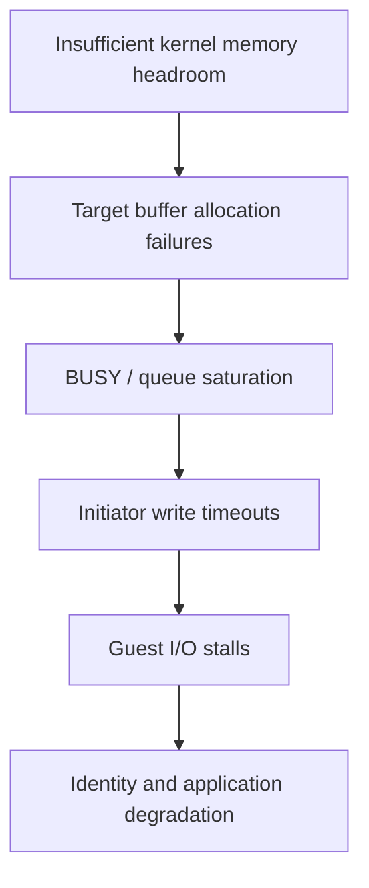

# Sanitized Storage Incident Analysis

## Summary

Several virtual machines became unresponsive even though the hypervisor still reported them as running, the iSCSI session was established, and the storage pool reported healthy. Cross-layer evidence showed that the storage target could not allocate request buffers, returned backpressure/errors to the initiator, and caused long write timeouts and guest I/O stalls.

## Impact chain

## Evidence considered

- hypervisor kernel I/O timeout timestamps;
- target service allocation errors and request sizes;
- storage-pool health and controller logs;
- switch counters, optics, link state, and dropped/error frames;
- iSCSI session continuity;
- kernel memory, slab, cache limits, and available headroom;
- dependent identity and application failures.

## Reasoning

The healthy pool ruled out a simple filesystem/pool failure but did not prove target service health. Clean physical-link counters reduced the likelihood of packet corruption. The temporal match between target allocation failures and initiator timeouts established the immediate failure mechanism.

The deeper kernel allocation cause could not be proven retrospectively because no complete memory snapshot existed at incident onset. The strongest risk factor was an automatically sized filesystem cache with too little memory reserved for the target service and kernel.

## Corrective action

A persistent upper cache limit was applied through the supported platform mechanism, leaving explicit memory headroom. The team did not simultaneously change target thread counts, swap, networking, firmware, and storage layout; this preserved causal clarity and rollback safety.

## Verification

- effective cache limit changed as intended;
- available memory increased;
- new target allocation failures stopped during the observation window;
- dependent storage and application paths recovered;
- monitoring follow-up was defined for target allocation errors, memory headroom, cache size, and initiator timeouts.

## Lesson

“Pool healthy,” “session connected,” and “VM running” are partial signals. A storage service can fail in the request path while all three remain true.

