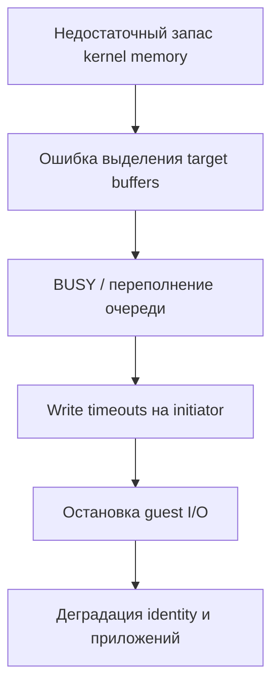

# Санитизированный разбор storage incident

## Кратко

Несколько виртуальных машин перестали отвечать, хотя hypervisor по-прежнему показывал их как работающие, iSCSI session оставалась установленной, а storage pool — healthy. Сопоставление событий на разных слоях показало: storage target не мог выделить request buffers, возвращал backpressure/errors инициатору, после чего возникали длительные write timeouts и остановка guest I/O.

## Цепочка влияния

## Рассмотренные доказательства

- timestamps I/O timeouts в kernel hypervisor;
- ошибки allocation в target service и размеры requests;
- состояние storage pool и controller logs;
- switch counters, optics, link state, dropped/error frames;
- непрерывность iSCSI session;
- kernel memory, slab, cache limits и доступный headroom;
- сбои зависимых identity- и application-сервисов.

## Ход анализа

Healthy pool исключал простую поломку filesystem/pool, но не подтверждал здоровье target service. Чистые counters физического линка уменьшали вероятность повреждения packets. Совпадение по времени ошибок allocation на target и timeouts на initiator установило непосредственный механизм отказа.

Точную первичную причину kernel allocation ретроспективно доказать было нельзя: на момент начала incident не сохранился полный memory snapshot. Наиболее сильным подтверждённым фактором риска был автоматически рассчитанный filesystem cache, оставлявший слишком мало памяти для target service и kernel.

## Корректирующее изменение

Через поддерживаемый платформой механизм был установлен постоянный верхний cache limit, сохраняющий явный memory headroom. Одновременно не менялись target thread counts, swap, networking, firmware и storage layout — это сохранило причинную ясность и возможность rollback.

## Проверка результата

- effective cache limit изменился ожидаемым образом;
- объём доступной памяти вырос;
- за окно наблюдения не появилось новых target allocation failures;
- зависимые storage- и application-paths восстановились;
- для monitoring были определены target allocation errors, memory headroom, cache size и initiator timeouts.

## Вывод

Сигналы «pool healthy», «session connected» и «VM running» отражают только отдельные слои. Storage service может отказать в request path, пока все три остаются формально истинными.
